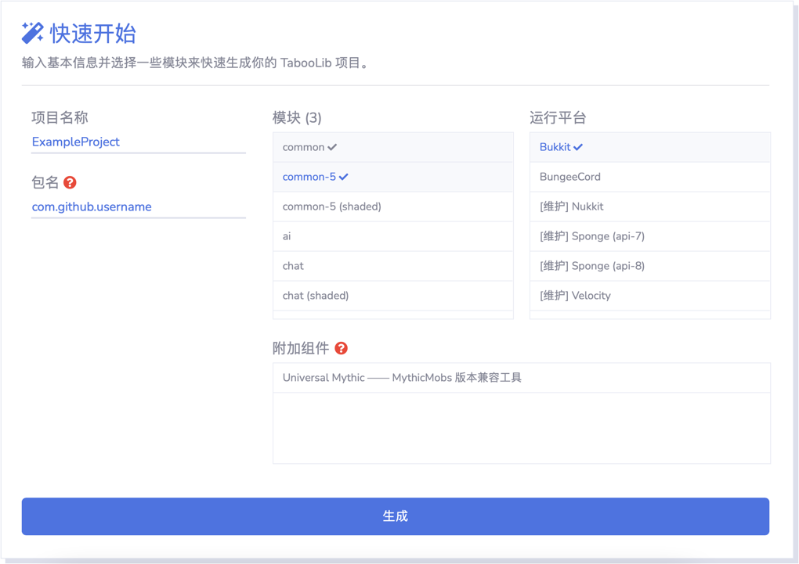

# 创建项目

本章内容介绍如何创建 TabooLib 项目。

## 从 QuickStart 开始

TabooLib 提供了一个快速开始的项目模板，你可以通过 [QuickStart](https://tabooproject.org/quickstart.html) 页面下载。



选择需要的模块及运行平台，随后点击 **生成** 按钮，下载完成后解压到你的项目目录。

## 从 TabooLib-SDK 开始

你也可以通过 [TabooLib-SDK](https://github.com/taboolib/taboolib-sdk) 项目来创建项目。

```bash
git clone --depth=1 https://github.com/taboolib/taboolib-sdk MyProject
```

```bash
Cloning into 'MyProject'...
remote: Enumerating objects: 25, done.
remote: Counting objects: 100% (25/25), done.
remote: Compressing objects: 100% (13/13), done.
remote: Total 25 (delta 0), reused 17 (delta 0), pack-reused 0
Receiving objects: 100% (25/25), 57.78 KiB | 365.00 KiB/s, done.
```

:::caution

使用 TabooLib-SDK 创建项目时，需要手动更新 TabooLib 版本。

:::